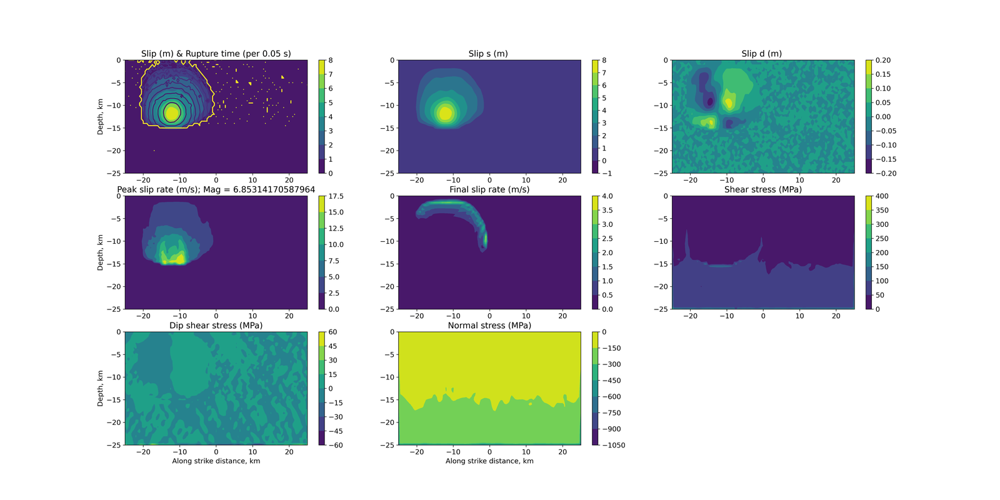

# test.drv.a6

Internal case (no SCEC spec): a fractal-rough strike-slip fault with
Drucker-Prager off-fault viscoplasticity and PML absorbing boundaries,
used for deterministic ground-motion studies. Verifies the plasticity +
PML + rough-fault path (`pastReleaseNotes.md`: "a fractal fault plastic
model for ground motion application").

| tier | dx (m) | term (s) | ranks (decomp) | ~cells | wall time | reference |
|---|---|---|---|---|---|---|
| fast (gate) | 500 | 5 | 4 (2,2,1) | 256k | ~48s (suite-aggregate, not case-isolated) | chaos-aware gate, `test.reference.results/test.drv.a6/` (rupture-front bistability tolerated, see `testsys/matrix.py`'s `DRV_A6` bounds and `testsys/compare.py`'s
`flip_budget_gate`) |
| full | -- | -- | -- | -- | -- | EXCLUDED: no published full-resolution run in README.md/pastReleaseNotes.md beyond this test config |

Provenance: SHA 5e76e8e, cotopaxi, Ubuntu 22.04/gfortran 11.4.0/OpenMPI
4.1.1, 2026-09-14, shared box (fast wall time is a 7-case suite total /7,
not individually timed).
