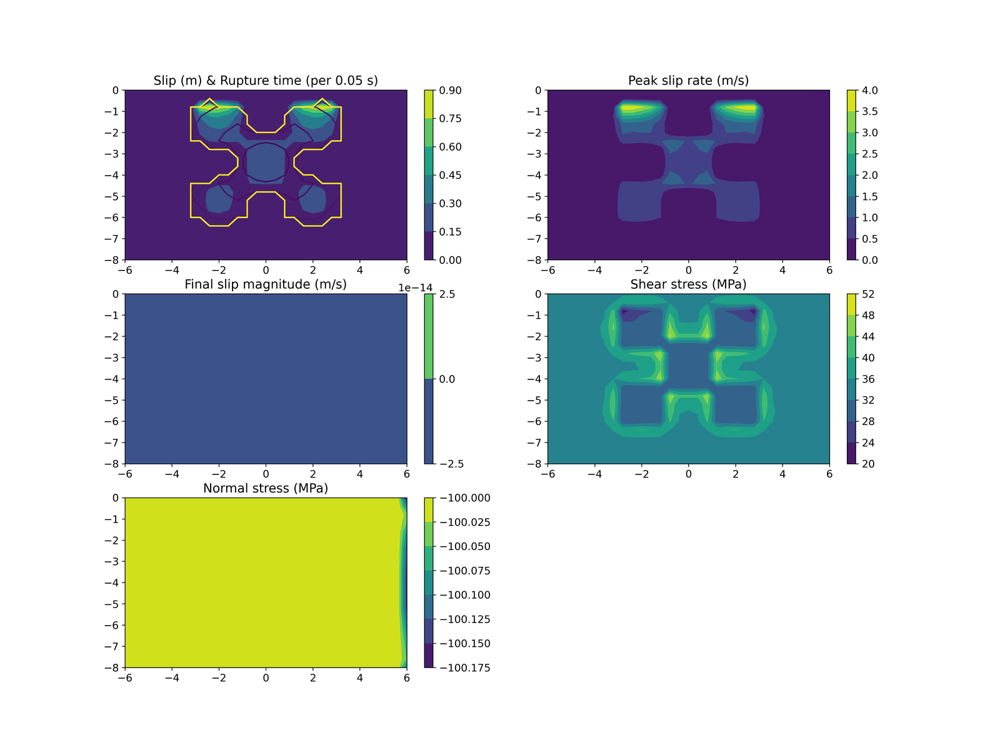

# test.meng2023cb

Internal case (no SCEC spec): same layered 1D velocity structure and
friction law as test.meng2023a, but with multiple barrier nucleation
patches instead of one central patch. Verifies heterogeneous-material
handling under a different nucleation geometry (`pastReleaseNotes.md`:
"test system now supports ... meng2023a, meng2023cb").

| tier | dx (m) | term (s) | ranks (decomp) | ~cells | wall time | reference |
|---|---|---|---|---|---|---|
| fast (gate) | 400 | 5 | 4 (2,2,1) | 510k | ~48s (suite-aggregate, not case-isolated) | frozen golden, `test.reference.results/test.meng2023cb/` |
| full | -- | -- | -- | -- | -- | EXCLUDED: no published full-resolution run in README.md/pastReleaseNotes.md beyond this test config |

Provenance: SHA 5e76e8e, cotopaxi, Ubuntu 22.04/gfortran 11.4.0/OpenMPI
4.1.1, 2026-09-14, shared box (fast wall time is a 7-case suite total /7,
not individually timed).
