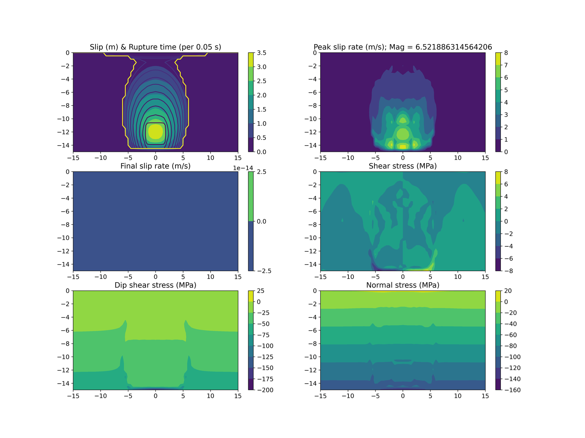

# test.tpv10

SCEC TPV10: a 60-degree dipping normal fault in a homogeneous elastic
halfspace, slip-weakening friction, verifies dip-fault geometry handling
(mesh tilt, depth-dependent normal stress) against the cross-code SCEC
reference solutions.

| tier | dx (m) | term (s) | ranks (decomp) | ~cells | wall time | reference |
|---|---|---|---|---|---|---|
| fast (gate) | 500 | 5 | 4 (2,2,1) | 168k | ~48s (suite-aggregate, not case-isolated) | frozen golden, `test.reference.results/test.tpv10/` |
| full (spec) | 100 | 15 | 16 (4,2,2) | ~21M (est.) | ~6-9h (est.) | report-only, no golden reference at this resolution |

Spec: 100 m node spacing on the fault plane, 0.0-15.0 s post-nucleation
(https://strike.scec.org/cvws/tpv10_11docs.html, download/TPV10_11_Description_v7.pdf).
Cross-code results: https://strike.scec.org/cvws/metric_cvv1_u1/tpv10/metric_cvv1_tpv10_ar_0.html

Provenance: EQdyna shortly after v5.4.0, cotopaxi, Ubuntu 22.04/gfortran 11.4.0/OpenMPI
4.1.1, 2026-09-14, shared box (fast wall time is a 7-case suite total /7,
not individually timed); full-tier wall time is `(500/dx)^4 * term-ratio` scaled from that
aggregate and divided by the 4->16 rank increase (assumes near-ideal
strong scaling, unverified) -- an estimate, not a measurement.
