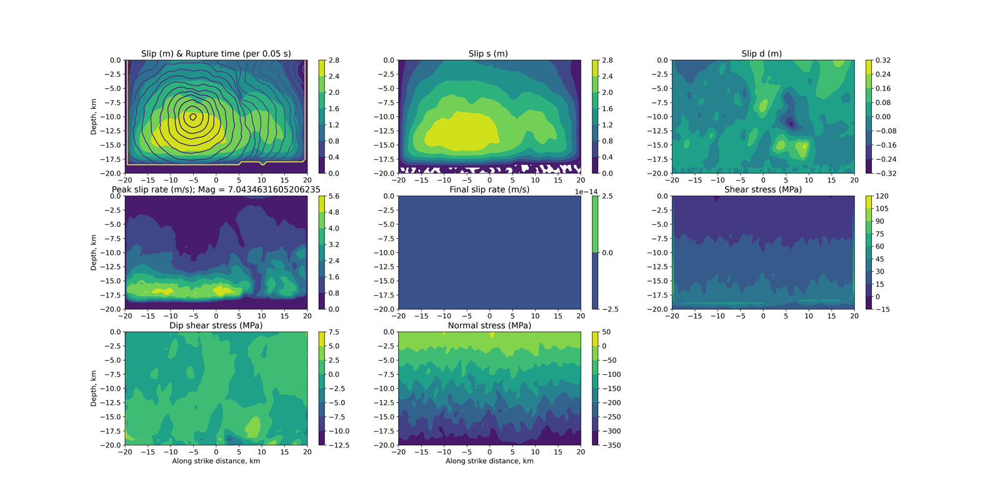

# test.tpv29

SCEC TPV29: a vertical right-lateral strike-slip fault on a self-similar
**fractal rough surface** (Hurst 1), 40 x 20 km, reaching the free surface, in
a homogeneous elastic halfspace with slip-weakening friction. SCEC supplies the
exact surface at 25 m sampling so every code runs the same roughness; the
shipped `bFault_Rough_Geometry.tpv29.100m.txt` is an exact decimation of it and
`tpv29GeometryTools.py` regenerates the file for whatever `par.dx` is set.

| tier | dx (m) | term (s) | ranks (decomp) | ~cells | wall time | reference |
|---|---|---|---|---|---|---|
| fast (gate) | 500 | 20 | 4 (2,1,2) | 0.88 M | ~3 min | frozen golden, `test.reference.results/test.tpv29/` |
| full (spec) | 50 | 20 | see note | 119 M | ~0.7 h on 1024 ranks (est., HPC) | report-only |

**`ny=1` is deliberate**: the fault plane sits at y=0, and a partition boundary
landing on it used to halve on-fault tractions (fixed; a hard-stop guard now
refuses that configuration). Keep the fault off rank boundaries — `ny=1`, or
`par.ymax /= -par.ymin`.

Coarse-resolution caveat: at 500 m the fractal surface is a 20:1 decimation of
the official data, i.e. a smoother fault. It is a valid regression baseline,
not the benchmark. Validation at matched resolution: the current code at 100 m
agrees with EQdyna's published 2015 100 m submission to **0.006 s median**
rupture time (500 m: 0.076 s); slip agrees between the 100 m and 500 m runs to
~4% (2.90 vs 2.78 m max).

Spec: 50 m preferred / 100 m acceptable, 0-20 s
(https://strike.scec.org/cvws/tpv29_30docs.html). Cross-code results:
https://strike.scec.org/cvws/metric_cvv1_u1/tpv29/metric_cvv1_tpv29_ac_0.html
Past submissions archived in `scec_archive/tpv29/`.

Provenance: reference frozen from EQdyna at the fault-MPI fix, cotopaxi,
gfortran 11.4.0 / Open MPI 4.1.1, 2026-09-14.
