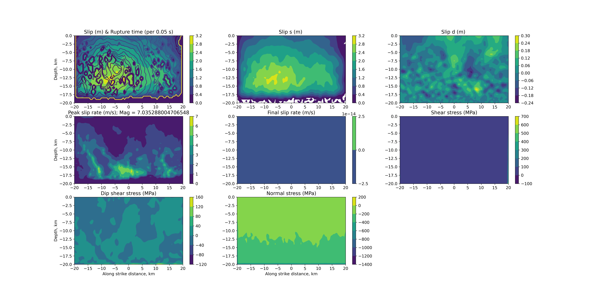

# test.tpv30

SCEC TPV30: the rough-fault benchmark TPV29 with off-fault Drucker-Prager
viscoplasticity added. Same 40 x 20 km fractal rough fault (Hurst 1), same
slip-weakening friction, same smoothed forced-rupture nucleation, same
stations, same 0-20 s run -- spec p.11: "The material properties are the only
difference between the elastic benchmark (TPV29), and the viscoplastic
benchmark (TPV30)."

## Relationship to test.tpv29

This compset is test.tpv29 plus the "--- TPV30 off-fault plasticity" block in
`user_defined_params.py` (C_elastic=0, Drucker-Prager cohesion/bulk-friction,
the viscoplastic relaxation time, the deviatoric-stress depth taper, and a
plastic-strain output window sized for this fault). Everything else --
geometry, initial on-fault stress tensor, friction, nucleation, stations -- is
the same values as test.tpv29.

`tpv29GeometryTools.py` and `bFault_Rough_Geometry.tpv29.100m.txt` in this
directory are BYTE-IDENTICAL copies of test.tpv29's own files (md5
f6df5ececc9d95d0c6db43c9ba0c3c6e) -- TPV30 uses the identical official rough
surface, so nothing about the geometry tooling changes; see
`case_input/test.tpv29/README.md` for the full provenance chain, decimation
rule, and regeneration commands, which apply unchanged here.

**The 50 m spec-resolution file is NOT shipped in this directory yet** (only
the 100 m file, needed for the dx=500 m gate below). Running the recorded
`full_specs.py` 50 m tier for this case first needs
`bFault_Rough_Geometry.tpv29.50m.txt` copied in from `case_input/test.tpv29/`
(or regenerated via `tpv29GeometryTools.py --official ... --dx 50`) -- deferred
until the 50 m spec-resolution tier is actually run.

## The swtwNucleation branch

TPV30's spec (p.16) states "Benchmarks TPV29 and TPV30 use linear
slip-weakening friction", and Part 6 (the smoothed forced-rupture nucleation
formula) is not restated separately for TPV30 -- it applies to both
benchmarks identically, the same way it applies to TPV36/37/201. This case
declares `par.tpv = 30`, which requires `TPV==30` in
`faulting.f90:swtwNucleation`'s branch list (and the matching tuple in
`eqdyna/faulting.py`) -- added as part of landing this case, rather than
having `test.tpv30` impersonate `par.tpv = 36` to reach the formula (the
anti-pattern that hid test.tpv29's own nucleation gap for months).

## Viscoplastic parameters (spec Part 7, p.19)

| parameter | value | case input |
|---|---|---|
| cohesion c | 1.18 MPa | `par.coheplas` |
| bulk friction nu | 0.1680 | `par.bulk` |
| viscoplastic relaxation time Tv | 0.05 s | `par.viscoplasticRelaxTime` |
| deviatoric-stress depth taper | 17-22 km | `par.devStrTaperDepthStart/End` |
| fluid pressure Pf | hydrostatic | `par.gamar = 0` |

`par.viscoplasticRelaxTime` and `par.devStrTaperDepthStart/End` are real case
inputs as of 2026-09-17 -- before that, Tv was hardcoded as
`2*dz/3464` (a mesh-resolution stand-in for a material property, landing on
0.05 s only at dx ~ 87 m) and the off-fault deviatoric pre-stress had no depth
taper at all. Both gaps are what blocked this case from being promoted; see
`git log --oneline -- src/fortran/readInputFiles.f90 src/fortran/func_lib.f90`
in the project's history for the change that closed them.

## Gate status: registered 2026-09-23, 5 s / dx=500 m, fortran + python-jax

The owner decided to gate this case at the one 5 s gate term. The reference
`test.reference.results/test.tpv30/` (frt.canonical.txt + fault.dyna.r.nc)
is the 5 s Fortran run, which retired the earlier 20 s scoping
reference. The bound is 1e-10 (abs-max); python-jax was observed at
1.909216e-14. With the underlying fix reverted, the 5 s cell reads
1.202240e+08, so the gate catches the defect described below.
`cRuptureDynamics.png` beside the reference is still the 20 s image (it is not
compared). The account below is kept as the history of the finding.

**Finding (2026-09-17, first real 3-backend sweep of this case):**
python-numpy and python-jax agree with EACH OTHER to ~1e-3 over the full
3321-node canonical grid at t=20s, but both disagree with the Fortran
reference by up to 4.0e8 Pa (about 30% relative) at final on-fault normal
stress, at a majority of fault nodes (3310 of 3321 differ by >1e6 Pa) -- not
a handful of marginal nodes, and not limited to the 17-22 km deviatoric-taper
zone or to fault-edge/border nodes (an interior, mid-fault, already-ruptured
node at 11.5-14.5 km depth shows the same ~25-30% relative divergence).

This is a genuine, deterministic divergence, not per-backend chaos: true
floating-point chaos would not leave numpy and jax nearly identical to EACH
OTHER while both are far from Fortran -- it would make all three drift
apart by different amounts (this is exactly how test.drv.a6's OWN
already-gated bistability looks: numpy and jax there disagree with each
other, 423 vs 415 flips out of a 450 budget, not just with Fortran).

Binary-searched to a time window, not yet to a line:
  - **t=1.0 s (24 steps): bit-exact.** Fortran (4-rank) and python-numpy
    (serial) canonical output agree to 1.6e-14 over all 22 columns and all
    3321 nodes, including the hypocenter's slip/traction. This means the
    STATIC wiring -- `par.viscoplasticRelaxTime`, `par.devStrTaperDepthStart/
    End`, the b11/b33/theta initial-stress resolution, the Drucker-Prager
    return map itself -- is correctly ported; none of the new
    plumbing is the defect.
  - **t=6.0 s (144 steps): already diverged.** Max diff across all 22
    columns is 1.6e8 Pa (col 11, normal stress) and column 3 (fnft) already
    shows a >9.9e4 s difference at at least one node -- a genuine
    rupture-arrival status flip (ruptured on one side, sentinel 99999 on the
    other), the same signature test.drv.a6's flip-budget gate exists to
    count. By this point EVERY one of the 3321 nodes already differs by
    >1e3 Pa.
  - The window between 24 and 144 steps (roughly 1-6 s of simulated time)
    is where the first real divergence happens and has NOT been isolated
    further (would need per-step or per-element dumps on both sides, i.e.
    a debug Fortran build -- out of scope for this pass; see NOTES_tpv30_gate.md).

**What this is not:** not the G6 half-traction blocker (that measured ratio
was exactly 0.5, depth-independent, from the very first output step;
this is a growing, node-dependent divergence that starts at ZERO and only
appears after the return map has been exercised for many steps). Not a
missing-feature gap (both new inputs are bit-exact-verified at t=1s). Most
likely a genuine algorithmic difference in how the Python port's
Drucker-Prager viscoplastic return map interacts with the ROUGH (non-planar)
fault over many steps -- test.drv.a6 is the only other gated case that
combines C_elastic=0 with a rough fault, and it needed a dedicated
flip-budget gate (not abs-max) for exactly this kind of reason. TPV30 may
need the same treatment, or a real fix; neither has been attempted here.

`testsys/parity/evidence_tpv30_vs_tpv29_contrast.py` is
written and report-only-correct, but was not run against a genuinely
completed pair of directories as part of closing this finding -- run it
once the divergence above is resolved and a real reference is frozen.

## Fault geometry

Same as test.tpv29 -- see that compset's README for the full provenance
chain, the decimation rule (`lib.requireFaultGeometryResolution`), and the
regeneration commands (`tpv29GeometryTools.py`).

| tier | dx (m) | term (s) | ranks (decomp) | status |
|---|---|---|---|---|
| fast (gate candidate) | 500 | 20 | 4 (2,1,2) | Fortran verified correct; NOT gated (see finding above) |
| full (spec) | 50 | 20 | not yet run (recorded in `testsys/e2e/full_specs.py`, not executed) | -- |

Spec: 50 m preferred / 100 m acceptable, 0-20 s
(https://strike.scec.org/cvws/tpv29_30docs.html). Downloaded copy at
`scratch/tpv29/downloads/TPV29_30_Description_v06.pdf` (shared with
test.tpv29 -- one PDF covers both benchmarks).

## Independent validation

`testsys/parity/evidence_tpv30_vs_tpv29_contrast.py` compares a completed
test.tpv29 run against a completed test.tpv30 run at the same dx: ruptured
area, slip statistics, seismic moment/Mw, and an acausal-rupture-time check
(nodes whose recorded rupture time predates any possible P-wave arrival from
the hypocenter -- a defect signature, not a tolerance question). REPORT-ONLY,
never a gate, never wired into `testsys/run.py` -- see that script's own
docstring. TPV30's own gate is the e2e sweep's frt.canonical.txt comparison
against test.tpv29's identical physics minus plasticity, same as every other
gated case.

Provenance: reference frozen from EQdyna after landing the `TPV==30`
swtwNucleation branch and the viscoplastic input wiring,
2026-09-17.
