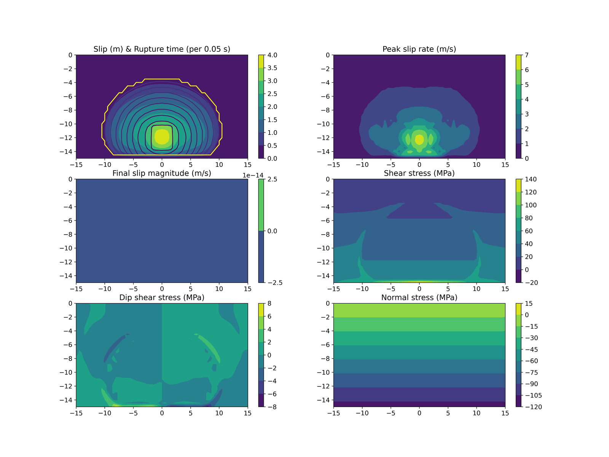

# test.tpv8

SCEC TPV8: a vertical strike-slip fault (planar, 30 km long, 15 km deep) in
a homogeneous elastic halfspace, slip-weakening friction, verifies the
basic dynamic-rupture solver (mesh/FE kernel, fault traction update,
nucleation) against the cross-code SCEC reference solutions.

| tier | dx (m) | term (s) | ranks (decomp) | ~cells | wall time | reference |
|---|---|---|---|---|---|---|
| fast (gate) | 500 | 5 | 4 (2,2,1) | 77.4k | ~48s (suite-aggregate, not case-isolated) | frozen golden, `test.reference.results/test.tpv8/` |
| full (spec) | 100 | 15 | 16 (4,2,2) | ~9.7M (est.) | ~6-9h (est.) | report-only, no golden reference at this resolution |

Spec: 100 m element size/node spacing, 0.0-15.0 s post-nucleation
(https://strike.scec.org/cvws/tpv89docs.html, download/TPV8_forwebsite.pdf
p.7). Cross-code results: https://strike.scec.org/cvws/metric_cvv1_u1/tpv8/metric_cvv1_tpv8_ar_0.html

Provenance: SHA 5e76e8e, cotopaxi, Ubuntu 22.04/gfortran 11.4.0/OpenMPI
4.1.1, 2026-09-14, shared box (fast wall time is a 7-case suite total /7,
not individually timed); full-tier wall time is `(500/dx)^4 * term-ratio` scaled from that
aggregate and divided by the 4->16 rank increase (assumes near-ideal
strong scaling, unverified) -- an estimate, not a measurement.
