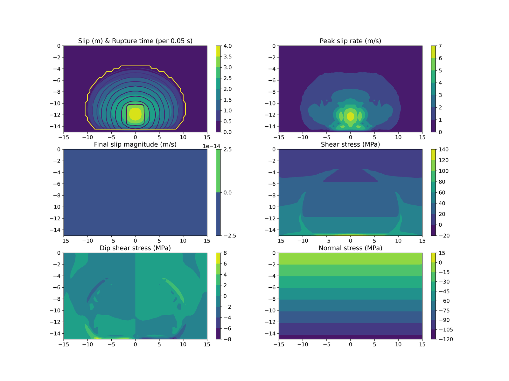

# Benchmarks

EQdyna is verified against the SCEC/USGS Spontaneous Rupture Code
Verification Project benchmarks (https://strike.scec.org/cvws/). Every case
is checked at a coarse resolution (5 s of simulated time) against a frozen
reference result by the local benchmark sweep, which runs before each
release. The automatic checks on GitHub run only a short portability test
(`test.tpv8`), not the full physics sweep. Each case can also be reproduced
at its official spec resolution and duration, which takes hours and is not
run automatically.

## Running the benchmarks

Fast check, minutes, all cases at 5 s of simulated time:

```
python3 testsys/run.py e2e
```

Each case runs on both the Fortran solver and the Python (JAX) solver and is
compared against one committed reference for that case.

Full spec-resolution reproduction, hours, opt-in, report-only:

```
EQDYNA_FULL_LAUNCH=yes-hours python3 testsys/run.py e2e-full
```

Without the environment variable the command prints what it would run and
exits without launching, so a long run can never start by accident.

## How the fault geometry is prepared

Each benchmark reaches its target resolution by decimating a shipped fault
surface -- every value used is an official one, nothing is interpolated -- so
a clean checkout needs no downloads. `test.tpv29` ships its surface at 100 m
and 50 m; a resolution finer than the shipped source, or not a multiple of
it, is refused rather than approximated. See
`case_input/test.tpv29/README.md` for the official SCEC source file and how
to add a finer one.

## Example plot



The image above is copied from `case_input/test.tpv8/cRuptureDynamics.png`,
the plot `scripts/plotRuptureDynamics` produces for that case's own run.
Every other case's own plot ships in its own `case_input/<case>/` directory
and is linked, not copied, from the "details" column below.

## Benchmark cases

| case | physics | SCEC benchmark | spec dx / duration | details |
|---|---|---|---|---|
| test.tpv8 | strike-slip, slip-weakening | [TPV8](https://strike.scec.org/cvws/tpv89docs.html) | 100 m / 15 s | [README](https://github.com/EQDYNA/EQdyna/blob/master/case_input/test.tpv8/README.md) |
| test.tpv10 | dipping normal fault | [TPV10](https://strike.scec.org/cvws/tpv10_11docs.html) | 100 m / 15 s | [README](https://github.com/EQDYNA/EQdyna/blob/master/case_input/test.tpv10/README.md) |
| test.tpv104 | strike-slip, rate-and-state friction | [TPV104](https://strike.scec.org/cvws/tpv103_104docs.html) | 50 m / 12 s | [README](https://github.com/EQDYNA/EQdyna/blob/master/case_input/test.tpv104/README.md) |
| test.tpv1053d | rate-and-state + thermal pressurization | [TPV105-3D](https://strike.scec.org/cvws/tpv105_3D_docs.html) | none published | [README](https://github.com/EQDYNA/EQdyna/blob/master/case_input/test.tpv1053d/README.md) |
| test.tpv29 | strike-slip, fractal rough fault | [TPV29](https://strike.scec.org/cvws/tpv29_30docs.html) | 50 m / 20 s | [README](https://github.com/EQDYNA/EQdyna/blob/master/case_input/test.tpv29/README.md) |
| test.tpv30 | rough fault + off-fault plasticity | [TPV30](https://strike.scec.org/cvws/tpv29_30docs.html) | 50 m / 20 s | [README](https://github.com/EQDYNA/EQdyna/blob/master/case_input/test.tpv30/README.md) |
| test.drv.a6 | fractal fault + off-fault plasticity | internal, no published spec | -- | [README](https://github.com/EQDYNA/EQdyna/blob/master/case_input/test.drv.a6/README.md) |
| test.meng2023a | layered velocity structure | internal, no published spec | -- | [README](https://github.com/EQDYNA/EQdyna/blob/master/case_input/test.meng2023a/README.md) |
| test.meng2023cb | layered velocity, multi-patch | internal, no published spec | -- | [README](https://github.com/EQDYNA/EQdyna/blob/master/case_input/test.meng2023cb/README.md) |
| test.tpv22 | strike-slip, two vertical planar faults, extensional (1.6 km) stepover | [TPV22/23](https://strike.scec.org/cvws/tpv22_23docs.html) | 100 m (50 m optional) / 15 s, release-only | [params](https://github.com/EQDYNA/EQdyna/blob/master/case_input/test.tpv22/user_defined_params.py) |
| test.tpv35 | Parkfield 2004 M6 validation: vertical strike-slip fault, two-sided layered velocity structure, inverted friction and initial stress, no artificial nucleation | [TPV35](https://strike.scec.org/cvws/tpv35docs.html) | 100 m (50 m optional) / 18 s | [README](https://github.com/EQDYNA/EQdyna/blob/master/case_input/test.tpv35/README.md) |
| test.tpv34 | Imperial Fault Model 1: vertical strike-slip fault in the 3D CVM-H velocity structure (n2mat==6 grid), stresses scaled by local shear modulus, stress-bump nucleation | [TPV34](https://strike.scec.org/cvws/tpv34docs.html) | 25-50 m (submitter's choice) / 20 s | [README](https://github.com/EQDYNA/EQdyna/blob/master/case_input/test.tpv34/README.md) |
| test.tpv23 | strike-slip, two vertical planar faults, compressional (1.0 km) stepover | [TPV22/23](https://strike.scec.org/cvws/tpv22_23docs.html) | 100 m (50 m optional) / 15 s, release-only | [params](https://github.com/EQDYNA/EQdyna/blob/master/case_input/test.tpv23/user_defined_params.py) |

`test.tpv22`/`test.tpv23` run at their own 15.0 s gate term, not the everyday
5.0 s one (the spec requires 15 s post-nucleation for fault #2 to rupture at
all), and are checked only before a release, not in the everyday sweep,
because running two faults at that longer term costs measurably more than
the everyday cases. They ship with no `README.md` yet (see the
`user_defined_params.py` link above instead), same gap as the two below.

`test.tpv36` and `test.tpv37` (dipping thrust, wedge degeneration) are also
gated on both solvers but do not yet have their own case README.

## Known limitations

* Every case is compared at 5 s of simulated time. For `test.tpv29`,
  `test.tpv36` and `test.tpv37`, 47-63% of the fault ruptures after 5 s, and
  that late rupture is not checked automatically.
* An independent cross-code comparison of `test.tpv29`/`test.tpv30` against
  the original 2015 SCEC submissions exists as a script, but is run by hand,
  not as part of any automatic check; see `case_input/test.tpv29/README.md`.

See `docs/user/performance.md` for wall-clock and memory figures.
